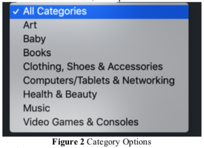
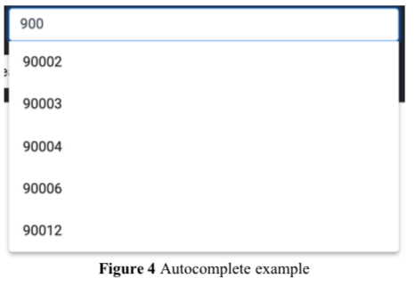
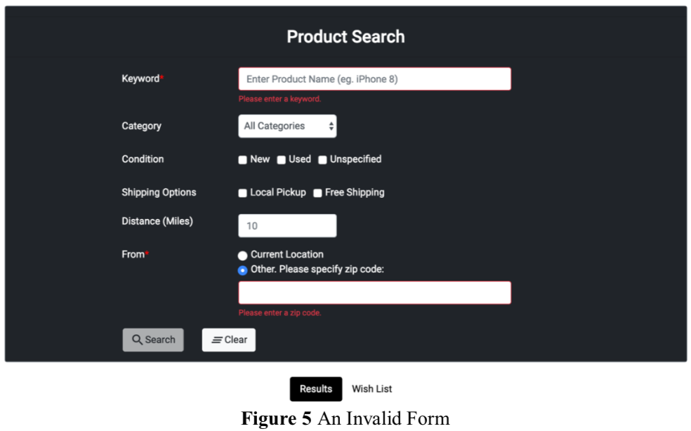
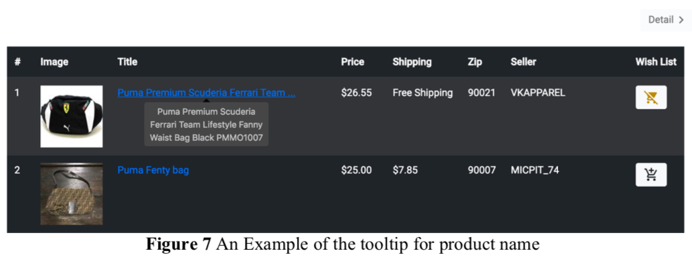
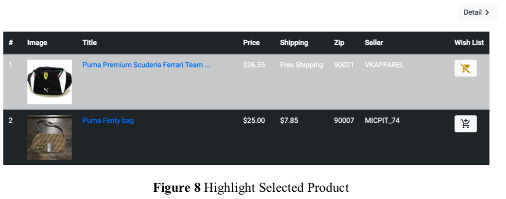

## 3. High Level Description

- In this exercise you will create a webpage that allows users to search for products using the eBay API and display the results on the same page below the form.

- Once the user clicks on a product name to search for product details, your webpage should display 5 tabs which contain a Product info tab, Product photos tab, Shipping info tab, Seller info tab and a Similar products tab related to the product, respectively.

- Your webpage should also support adding products to and removing products from the wish list and sharing products info to Facebook.

  

  [Figure 1](./images/figure_1.png)

## 3.1 Search Form

### 3.1.1 Form Design

- You must replicate the search form displayed in Figure 1 using a **Bootstrap form**. The form fields are similar to Homework #6.
- Six Inputs:
  - **Keyword**: 
    - This field is **required**.
    - Validation is performed on this field.
    - Please refer to **section 3.1.3 for details of validation**.
    - Initially, please **show the placeholder shown in the picture**.
    - No need to cache keywords, as we did not write on the doc. Caching keywords is an optional function. [@668](https://piazza.com/class/jptzz79d354gb?cid=668).
  - **Category**:
    - The **default value of “Category” is “All Categories”**, which covers most of the “types” provided by the eBay API.
    - The other options are shown in Figure 2.
      - 
  - **Condition**:
    - There are 3 options for the user to select from: **New, Used and Unspecified**.
    - Multiple options could be selected to get results for all of them.
  - **Shipping Options**:
    - There are 2 options provided: **Local Pickup and Free Shipping**.
    - The user again has the option to select 1 or both of them.
  - **Distance (Miles)**:
    - This is the radius of the area within which the search is performed.
    - The center of the area is specified in the “Current Location” field.
    - The **default value is 10** miles.
  - **From**:
    - The center of the area within which the search is performed.
    - The user can choose between their **current location or other location based on the zip code**.
    - This field is **required** (the user must either choose the first radio button or choose the second one and provide a location) and **must be validated**.
    - Please refer to section 3.1.3 for details of validation.
    - The input box below the **second radio button is disable by default**.
    - If the user chooses to provide a different location, this input field should be enabled.
    - The **error message and the zip code** value should be cleared when "current location" radio button is selected [@606](https://piazza.com/class/jptzz79d354gb?cid=606).
  - **Buttons**:
    - **Search**:
      - The “Search” button should be **disabled whenever either of the required fields is empty or validation fails, or the user location is not obtained yet**.
      - Please refer to section 3.1.3 for details of validation.
      - Please refer to section 3.1.4 for details of obtaining user location.
    - **Clear**:
      - This button must reset the
        - form fields
        - clear all validation errors if present
        - switch the view to the results tab
        - clear the results area.

### 3.1.2 AutoComplete

- Autocomplete for zip code is implemented by using the suggestion service provided by Geonames.
  - Please go to this page to learn more about this service:
    - https://www.geonames.org/export/web-services.html
- An example of an HTTP request to the Geonames API Get Suggestion that searches for the zip code “900” is shown below:
  - http://api.geonames.org/postalCodeSearchJSON?postalcode_startsWith=900&username=[Username]&country=US&maxRows=5
  - [Figure 3](./images/figure_3.png)
- To get Username in the above URL:
  - Register at http://www.geonames.org/login
  - In the API call, the “Username” is the username you entered during registration.
- **Note**:
  - Set the maxRows to 5 to limit the number of suggestions.
  - If the **Geonames API doesn’t work, hide the autocomplete feature**. This situation should be handled and not throw any error.
  - Geo names API should be called from node js and ip-api from angular [@611](https://piazza.com/class/jptzz79d354gb?cid=611).
- You must use **Angular Material** to implement the Autocomplete. (See section 5.4).
  - 

### 3.1.3 Validation

- Your application **should check if the “Keyword” contains something other than spaces**. If not, then **it’s invalid and an error message should be shown**, and the border of the input field should turn red as in Figure 5
  - .
- If the **second radio button of “From” field is chosen**, the **same validation should be performed for the input field** below the second radio button.
- The **zip code is restricted to only 5 digits**.
- The **search button should be disabled** until and **unless a 5-digit zip code is provided**. If any other characters are included, the search button should not be enabled.
- Please watch the reference video carefully to understand the validation behavior.

### 3.1.4 Obtaining User Location

- As in Homework #6, you should obtain the current user location using one of the geolocation APIs.
- The usage of this API has been explained in the Homework #6 documents. 
  - http://ip-api.com/json

### 3.1.5 Search Execution

- Once the validation is successful and the user clicks on the “Search” button, your application should make an AJAX call to the Node.js script hosted on GAE/AWS/Azure.
- The Node.js script on GAE/AWS/Azure will then make a request to eBay API to get the product’s information.
- This will be explained in the next section.

## 3.2 Results Tab

### 3.2.1 Results Table

- In this section, we outline how to use the form inputs to construct HTTP requests to the eBay API service and display the result in the webpage.
- The eBay API Search Service is documented here:
  - https://developer.ebay.com/DevZone/finding/Concepts/FindingAPIGuide.html
- The eBay Finding API service to “make a call” is documented here:
  - https://developer.ebay.com/DevZone/finding/Concepts/MakingACall.html
- The usage of these two APIs has been explained in the Homework #6 documents.
- An example of an HTTP request to the eBay Finding API that searches for the products related to iPhone within a 10 miles radius from the user’s current location is shown below:
  - http://svcs.ebay.com/services/search/FindingService/v1?OPERATIONNAME=findItemsAdvanced&SERVICE-VERSION=1.0.0&SECURITY-APPNAME=[APPID]&RESPONSE-DATA-FORMAT=JSON&RESTPAYLOAD&paginationInput.entriesPerPage=50&keywords=iphone&buyerPostalCode=90007 &itemFilter(0).name=MaxDistance&itemFilter(0).value=10&itemFilter(1).name=FreeShipping Only&itemFilter(1).value=true&itemFilter(2).name=LocalPickupOnly&itemFilter(2).value=true &itemFilter(3).name=HideDuplicateItems&itemFilter(3).value=true&itemFilter(4).name=Condit ion&itemFilter(4).value(0)=New&itemFilter(4).value(1)=Used&itemFilter(4).value(2)=Unspecif ied&outputSelector(0)=SellerInfo&outputSelector(1)=StoreInfo
- Note: **Changes in the URL from Homework 6**
  - paginationInput.entriesPerPage=50 (limit to 50 products).
  - outputSelector(0)=SellerInfo (To get Seller details for each product).
  - outputSelector(1)=StoreInfo (To get Store Info for each product).
- The **Node.js script should pass the JSON object** **returned by the Product Search** to the client side **or parse the returned JSON and extract useful fields** and pass these fields to the client side in JSON format.
- You should use JavaScript to parse the JSON object and display the results in a tabular format.
- A sample output is shown in [Figure_6](./images/figure_6.png)
- The displayed table includes eight columns:
  - \# (Index number)
  - Image
  - Title
  - Price
  - Shipping
  - Zip
  - Seller
  - Wish list.
- Below the table there is a **pagination feature** which is used to navigate to the next set of products.
  - There is a **maximum of 10 products on a page**.
  - The user can navigate to a different page directly by **clicking on the page number**, or by **using previous and next buttons**
  - It should not be hidden if items are less than 10 [@642](https://piazza.com/class/jptzz79d354gb?cid=642). 
- When the search result contains at least one record, you need to map the data extracted from the API results to the columns to render the HTML result table as described in [Table 1](./images/table_1.png).
  - Note: If any value is **missing in the first table please display “N/A”**.
- If a partic**ular image in the table is clicked** it should **open in a new tab**.
- The **“#” column** starts from 1 and goes till 50. Since every product may not have 50 results, you need to show as many results returned by eBay, limiting to 50 results in total and only 10 results per page. This needs to be done using pagination.
- The **“Title” column** might not be long enough to show the entire name of the product and **should show “…” to avoid starting a new row**. 
  - The “Title” column is **clickable to trigger the detail search** for the corresponding product.
- If a product is on the **Wish List**, the cart **icon is full** (Figure
  7 item 1). Otherwise, the cart icon is empty (Figure 7, item 2).
- You can follow this idea to avoid starting a new row for product name:
  - Judge whether the product name’s length is larger than 35 characters. (Or other
    reasonable number)
  - If yes, please cut the string to the first 35 characters, and if the cut position is not a whitespace, please find the last index of white space before the cut position and use that as the substring’s end index. **Implies Cut to the last word**.
  - Add ‘…’ to the new string.
  - Show the tooltip of the whole product name (Figure 7).
  - 
- For **tooltip** component, if you use entirely AngularJS/Angular2+, please use Angular Material to implement this. If you use jQuery, you could use the bootstrap tooltip. The style between bootstrap tooltip and Angular Material tooltip will be a slightly different, but it is fine. (See section 5.3 and 5.4)

### 3.2.3 Details Button and Highlighting

- The **“Details >” button**, right above the results table, **is initially disabled.**
- It will be **enabled** once a **product details search is triggered**.
- If this **button is enabled and clicked**, the **page will be taken to the Product detail tabs**.
- After a **product details search is performed**, the **corresponding product row in the results table should be highlighted** to indicate the product whose details are displayed in the Details tabs (Figure 8).
- Once you move to Wish List disable that again
- Both wish list and results have a separate detail button. If you select a product the detail button in results view remains enabled till clear, because there will always be one product selected. In Wish List view if a product is selected it will remain enabled till a product is selected and selected product is not deleted [@779](https://piazza.com/class/jptzz79d354gb?cid=779).
  - 

## 3.3 Details

- Once a product name in the **“Title” column is clicked**:
  - your webpage should **search for the details** of that product.
  - Above the tabs in the details view, you should display the whole name of the Product, a button that allows you to go back to the previous list, a Facebook button and a Wish List button.
- An example of an HTTP request to the eBay Shopping API that searches for details for a single product based on the ItemID is shown below:
  - http://open.api.ebay.com/shopping?callname=GetSingleItem&responseencoding=JSON&appid=[APPID]&siteid=0&version=967&ItemID=132961484706&IncludeSelector=Description,Details,ItemSpecifics
- The response for a single item is shown [Figure 9](./images/figure_9.png)
- Product detail tab [Figure 10](./images/figure_10.png)

### 3.3.1 Info Tab

- A table containing the detailed info of the product is displayed in this tab. The table has the following fields if they are available in the detail search results [Table 2](./images/table_2.png)
- **Note**: If any **value is missing**, **don’t display the row** in product info tab.
- When **clicked on “Product Images”**, **a modal should be popped up** with all product images. If a **particular image in the modal is clicked** it should **open in a new tab**. See video for reference.
  - The Carousel should wrap around. The previous and next buttons should not been seen if the product has only one image [@689](https://piazza.com/class/jptzz79d354gb?cid=689).

### 3.3.2 Photos Tab

- A table containing the images related to the product is displayed in this tab. The Google Custom Search Engine is documented at:
  - https://developers.google.com/custom-search/json-api/v1/overview
- To retrieve photos about the Product, the request needs 6 parameters (output should be JSON):
  - q: The search expression
  - cx: The custom search engine ID to use for this request
  - imgSize: Returns images of a specified size
  - num: Number of search results to return. (Valid values are integers between 1 and 10, inclusive.)
  - searchType: Specifies the search type: image. If unspecified, results are limited to webpages.
  - key: Your application's API key. This key identifies your application for purposes of quota management.
- An example of an HTTP request to the Google custom search API is shown below:
  - https://www.googleapis.com/customsearch/v1?q=[Product_Title]&cx=[YOUR_SEARCH_ENGINE_ID]&imgSize=huge&imgType=news&num=8&searchType=image&key=[YOUR_API_KEY]
  - [Figure 11](./images/figure_11.png) Google Customized Search API
- When the search result contains at least one record, you need to map the data extracted from the API results to the columns and render the HTML result table as described in [Table 3](./images/table_3.png).
- **display the photos**
  - in three columns
  - arrange them in the same manner as in [Figure 12](./images/figure_12.png) (from left to right, top to bottom).
  - When a photo is clicked, a new tab is opened to display that photo in its original size.
- **Note**: **Broken Images** in the Photos tab is fine.
- If the api does not  return images for certain rare titles, it is fine [@690](https://piazza.com/class/jptzz79d354gb?cid=690).

### 3.3.3 Shipping Tab

- To get the Shipping info, with the help of first API call you get the shipping information for each product.
- A table containing the detailed info of the Shipping details is displayed in this tab.
- The table has the following fields if they are available in the detail search results - [Table 4](./images/table_4.png)
- A sample of Shipping tab is shown as [Figure 13](./images/figure_13.png).
- **Note**: If any value is **missing**, don’t display that row in shipping info tab. 
- For **Expedited Shipping, One Day Shipping and Return Accepted** if the value is true then a **green tick mark** is to be displayed else a red cross is to be displayed.
  - Please refer Material Icons for the tick marks and red cross.
- For Handling Time if the value is 0 or 1 then append “Day”, if greater than 1 then append “Days”.

### 3.3.4 Seller Tab

- To get the Seller info, the eBay Shopping API will give you the details for the seller and the store.

- A table containing the detailed info of the store details of the seller is displayed in this tab.
- The table has the following fields, if they are available in the detail search results - [Table 5](./images/table_5.png)
- **Note**: If any **value is missing** **don’t display the row** in Seller info tab.
- The **Popularity** should be provided with a round progress bar.
  - For Angular2+ users, please use
    - https://github.com/crisbeto/angular-svg-round-progressbar
  - For AngularJS users, please use
    - https://github.com/crisbeto/angular-svg-round-progressbar/tree/angular-1.x
- The **Feedback Rating Star** will be based on the color, the corresponding material icon star with that color should be displayed.
  - For the color of stars:
    - https://developer.ebay.com/devzone/finding/callref/types/SellerInfo.html
  - For a value of Feedback score 
    - ~~**greater than 5000**, use **stars**~~
    - ~~**else** use **star_border** from material icons. (**Refer 5.5** for the icons)~~
    - **NEW** [@602](https://piazza.com/class/jptzz79d354gb?cid=602) Description also updated
      - For scores equal to **greater than 10,000 use stars** else **use star border with the colors mentioned.**
      - For **0-9 use color white**.
- For **Top Rated** if true display a green tick else display a red cross.
- On **Clicking Store**, the **link for the store should open in a new tab**.
  - [Figure 14](./images/figure_14.png)

### 3.3.5 Similar Products Tab

- This tab displays the similar products of the product clicked from the first table.
- **Details for the parameter of the API call** is given in the HW6 description.
- An example of an HTTP request to the eBay Merchandise API that searches for similar products to the product clicked initially is shown below:
  - http://svcs.ebay.com/MerchandisingService?OPERATIONNAME=getSimilarItems&SERVICE-NAME=MerchandisingService&SERVICEVERSION=1.1.0&CONSUMER-ID=[Your_APP_ID]&RESPONSE-DATAFORMAT=JSON&REST-PAYLOAD&itemId=292862774875&maxResults=20
- **Note:** Please set the maxResults to 20.
- The sample API response will be - [Figure 15](./images/figure_15.png)
- All fields in the table are present in the “item” object in the “itemRecommendations” object.
- Table details - [Table 6](./images/table_6.png)
- By **default**, Similar Products are displayed in the **default order (the order in which the items are returned by the API**).
- There are **two dropdowns** in this tab.
  - The **first one** allows the user to sort the products in several different categories: 
    - Default
    - Product Name
    - Days Left
    - Price
    - Shopping Cost.
  - The **second one** allows the user to sort in ascending or descending order. When the **sort category is “Default”**, the **sort order dropdown should be disabled (either Ascending or Descending)**.
  - [Figure 16](./images/figure_16.png): Dropdown to Sort the Products.
- By **default**, **only 5 similar products are displayed,** like shown in [Figure 17(a)](./images/figure_17a.png).
- After **clicking the “Show More”** button, all upcoming products in the returned JSON should be displayed, and the **button changes to “Show Less”,** like in [Figure 17(b)](./images/figure_17b.png).
- After **clicking “Show Less”** only **the top 5 similar products in given sorting order should remain**.
- **Note**: If the number of **products is less than 5, then don’t display “Show More” and “Shore Less” button**.
- **Note**:If the **API service returns an empty result set**, the page should **display** “**No Records.**”. [Figure 18](./images/figure_18.png)
- **Note:** There are two clickable items. One is the title which takes the user to ebay and the other is the image. There is no tooltip as there is big enough space to show the title. This is given in the description as well as the video [@628](https://piazza.com/class/jptzz79d354gb?cid=628).

### 3.3.6 List Button, Wish List Button and Facebook Button

- Once the **List button** is clicked, your webpage should go back to the previous list view, whether it’s the result list or the Wish List. [Figure 19](./images/figure_19.png).
- The **Wish List button** works the **same** way as the ones in the **result list**.
  - The Wish List button should maintain the consistency if that product was already added in the Wish List previously or it should not be added.
- The **Facebook button** allows the user to share product link and post it to Facebook.
  - Once the button is **clicked**, a **new dialog should be opened** and display the **default Facebook content** in this format - [Figure 20](./images/figure_20.png):
    - “Buy PRODUCT_NAME at PRICE from LINK below.”
    - Replace PRODUCT_NAME, PRICE and LINK with the real product name, price and viewItemURLForNaturalSearch in the “item” object in eBay Shopping API call.
  - Link for Facebook share:
    - https://developers.facebook.com/docs/sharing/reference/share-dialog
  - Facebook API's official doc suggest you implement share dialog on the client side. FB only provide a client-side JS library. Thus, sharing FB function should be done on the client side [@632](https://piazza.com/class/jptzz79d354gb?cid=632).
    - https://www.npmjs.com/package/ng2-facebook-sdk
- [Figure 21](./images/figure_21.png) Wish List and Facebook Buttons

## 3.4 Wish List Tab

- The Wish List tab is very similar to the Results tab:
  - the products on the list are displayed in a table
  - there is a button that allows the user to go to the details view and is disabled initially
  - the user can search for product details by clicking on the product name in the “product” column.
- The major differences between these two tabs are:
  - the product information displayed in the Wish List tab is saved in and loaded from the local storage of the browser
  - the buttons in the “Wish List” column of the Wish List tab is only used to remove a product from the list and has an icon for it to be removed from the Wish List. (Refer 5.5 for the icons)
- **Note**: There is **no Zip column in the Wish List tab**.
- There is a **Total Shopping** which stores the **total Price** which is the **sum of all products** in Wish List.
- **Please note** if a user **closes and re-opens the browser, its Wish List should still be there**.
- **Note**: If there are **no products in Wish List**, please show **‘No Records’.**
- **No pagination** for wishlist table [@610](https://piazza.com/class/jptzz79d354gb?cid=610).
- [Figure 22](./images/figure_22.png) Wish List

## 3.5 Error Messages

- If for any reason an error occurs whether its products search or details search, an appropriate error message should be displayed.
- [Figure 23](./images/figure_23.png) Error Message

## 3.6 No Records

- Whenever the search receives no records, an appropriate message should be displayed.
- [Figure 24](./images/figure_24.png) No Records on Similar Products
- [Figure 25](./images/figure_25.png) No Records on Wish List

## 3.7 Progress Bars

- Whenever data is being fetched, a dynamic progress bar must be displayed as shown in [Figure 26](./images/figure_26.png).
- You can use the progress bar component of Bootstrap to implement this feature.
- You can find hints about the bootstrap components in the Hints section.

## 3.8 Animation

- Whenever the view switches between Results/Wish List and details, there should be a sliding effect.
- Please check out the video to see the effect.
- The sliding animation must be implemented with AngularJS/Angular2+.

## 3.9 Responsive Design

- The following are snapshots of the webpage opened with Safari on iPhone 7 Plus. See the video for more details.
  - [Figure 27](./images/figure_27.png)
  - [Figure 28](./images/figure_28.png)
  - [Figure 29](./images/figure_29.png)
  - [Figure 30](./images/figure_30.png)
- **Note**:
  - The **Similar Products in the tabs** is **replaced by Related** in the Responsive design.
  - Make sure all tabs remain in 1 line for responsive design.
- Some of the requirements in the mobile view are listed here:
  - The search form should display each component in a vertical way (“stacked”) on smaller screens.
  - All tables can be scrolled horizontally (“panned”).
  - The photos should be aligned vertically, and use 100% width, on smaller screens.
  - Animations must work on mobile devices.
- You must watch the video carefully to see how the page looks like on mobile devices.
- **Important**:
  - All functions must work on mobile devices.
  - Mobile browsers are different from desktop browsers.
  - Even if your webpage works perfectly on a desktop, it may not work as perfect as you think on mobile devices.
  - It’s important that you also test your webpage on a real mobile device.
  - Testing it in the mobile view of a desktop browser will not guarantee that it works on mobile devices.

# 4. API Documentation

## 4.1 eBay API

- To use eBay API, you need first to register for an eBay Account. This is the same App id used for the HW6. You can re-use it.

## 4.2 Google Customized Search API
- This link will provide the details to get the API key:
  - https://developers.google.com/custom-search/json-api/v1/overview
- **Note**: You can **use any additional Angular libraries and Node.js modules** you like.

# 5. Implementation Hints

## 5.1 Images

- The images needed for this homework are available here:
  - http://csci571.com/hw/hw8/Images/facebook.png

## 5.2 Get started with the Bootstrap Library

- To get started with the Bootstrap toolkit, please refer to the link:
  - https://getbootstrap.com/docs/4.0/getting-started/introduction/.
- You need to import the necessary CSS file and JS file provided by Bootstrap.

## 5.3 Bootstrap UI Components

- Bootstrap provides a complete mechanism to make Web pages responsive to different mobile devices.
- In this exercise, you will get hands-on experience with responsive design using the Bootstrap Grid System.
- At a minimum, you will need to use Bootstrap Forms, Tabs, Progress Bars and Alerts to implement the required functionality.
- Bootstrap Forms
  - https://getbootstrap.com/docs/4.0/components/forms/
- Bootstrap Tabs
  - https://getbootstrap.com/docs/4.0/components/navs/#tabs
- Bootstrap Progress Bars
  - https://getbootstrap.com/docs/4.0/components/progress/
- Bootstrap Alerts
  - https://getbootstrap.com/docs/4.0/components/alerts/
- Bootstrap Tooltip
  - https://getbootstrap.com/docs/4.1/components/tooltips/
- Bootstrap Cards
  - https://getbootstrap.com/docs/4.0/components/card/

## 5.4 Angular Material

- **AngularJS Material:** 
  - https://material.angularjs.org/latest/
- Autocomplete:
  - https://material.angularjs.org/latest/demo/autocomplete
  - https://material.angularjs.org/latest/api/directive/mdAutocomplete
- Tooltip: 
  - https://material.angularjs.org/latest/demo/tooltip
- **Angular Material (Angular 2+):**
  - https://material.angular.io/
- Autocomplete:
  - https://material.angular.io/components/autocomplete/overview
- Tooltip:
  - https://material.angular.io/components/tooltip/overview

## 5.5 Material Icon

- Icons for the search button, clear button, left arrow, right arrow, add_shopping_cart, remove_shopping_cart, stars and star_border can be viewed here:
  - https://google.github.io/material-design-icons/
  - https://material.io/tools/icons/

## 5.6 Google App Engine/Amazon Web Services/ Microsoft Azure

- You should use the domain name of the GAE/AWS/Azure service you created in Homework #7 to make the request.
- For example, if your GAE/AWS/Azure server domain is called example.appspot.com/example.elasticbeanstalk.com/ example.azurewebsites.net, the JavaScript program will perform a GET request with keyword=”xxx”, and an example query of the following type will be generated:
  - GAE - http://example.appspot.com/searchProducts?keyword=xxx
  - AWS - http://example.elasticbeanstalk.com/searchProducts?keyword=xxx
  - Azure – http://example.azurewebsites.net/searchProducts?keyword=xxx
- Your **URLs don’t need to be the same** as the ones above.
- You **can use whatever paths and parameters you want**.
- **Please note** that in addition to the **link to your Homework #8**, you should also **provide a link like this URL in the table of your Node.JS backend link**.
  - When your grader clicks on this additional link, a valid link should return a JSON object with appropriate data.

## 5.7 Deploy Node.js application on GAE/AWS/Azure

- Since Homework #8 is implemented with Node.js and AWS/GAE/Azure, you should select Nginx as your proxy server (if available), which should be the default option.

## 5.8 AJAX call

- You should send the request to the Node.js script(s) by calling an Ajax function (Angular or jQuery).
- You **must use a GET method to request** the resource since you are required to provide this link to your homework list to let graders check whether the Node.js script code is running in the “cloud” on Google GAE/AWS/Azure (see 5.6 above).
- Please refer to the grading guidelines for details.

## 5.9 HTML5 Local Storage

- Local storage is more secure, and large amounts of data can be stored locally, without affecting website performance.
- Unlike cookies, the storage limit is far larger (at least 5MB) and information is never transferred to the server.
- There are **two methods, getItem() and setItem(), that you can use**.
- The **local storage can only store strings**.
- Therefore, you need to convert the data to string format before storing it in the local storage.
- For more information, see:
  - https://developer.mozilla.org/en-US/docs/Web/API/Window/localStorage
  - http://www.w3schools.com/html/html5_webstorage.asp

# 6. Files to Submit

- In your course homework page, you should **update the Homework #8 link to refer to your new initial web page** for this exercise.
- Additionally, you need to **provide an additional link to the URL of the GAE/AWS/Azure service where the AJAX call** is made with sample parameter values (i.e. a valid query, with keyword, location, etc. **See 5.6**).
- Also, electronically **submit all files (HTML, JS, CSS, TS) the you have personally written to the GitHub Classroom repository** so that they can be compared to all other students’ code.
  - **Don’t upload / push library, node-js modules, any config files, any angular-cli build files, or any image**s that we provided or that are included in any library or any code generated by the tools.
- **Please note, you need to submit your files (HTML, JS, CSS, TS), both backend and frontend, directly to the root folder of your homework 8 GitHub repository**.
  - That is, do not submit any subfolders on GitHub.
  - If you submit some subfolders, you will receive 3-points penalty.

# Important

- All API calls in homework 8 should be asynchronous. If we see the "hourglass", you will get a point deduction for non-async behavior. [@604](https://piazza.com/class/jptzz79d354gb?cid=604).
- Animating from detail view to results view [@637](https://piazza.com/class/jptzz79d354gb?cid=637).
  - It's not exactly clear from the video, but is the results view reloading when the details view slides out and the results view comes back in? I'm making this assumption because if the results were still cached and just removed from the DOM, the results would come back instantly without the need for a progress bar, no?
  - t is implementation based. You should show a progress bar if the results are not yet on the page, if you have the results the progress bar will not be seen.
- Image, Facebook share and ebay links in a new tab
- Carousel Yes, that is why even the first image has a left arrow. Think of it as a circular list [@689](https://piazza.com/class/jptzz79d354gb?cid=689).
- It is implementation based. You should show a progress bar if the results are not yet on the page, if you have the results the progress bar will not be seen [@637](https://piazza.com/class/jptzz79d354gb?cid=637).

# Not Understood

- What to use for product title in google custom search API? For the product title parameter, I was wondering if we use the keyword provided on the form by the user, the title from the ebay shopping API, or the title from the ebay finding API? [@605](https://piazza.com/class/jptzz79d354gb?cid=605)
  - The title from the ebay shopping API, the one you display on the page with 5 tabs.
- [@639](https://piazza.com/class/jptzz79d354gb?cid=639) Detail Button when no records found in result and wish list tab